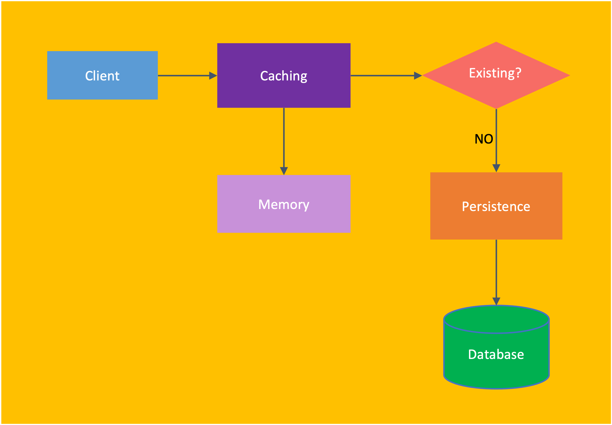

# this_is_java
Dech biet hoc duoc may bua .... 12/03/2024

Chủ đề cache:
Cache trong bộ nhớ (RAM cache)

“There are only two hard things in Computer Science: cache invalidation and naming things”. 

Memory Caching chỉ đơn giản là việc tổ chức và lấy dữ liệu trên bộ nhớ chính (RAM) 
vì tốc độ của bộ nhớ này rất nhanh, dữ liệu không có trên bộ nhớ sẽ được lấy từ cơ sở dữ liệu 
và dữ liệu trên bộ nhớ khi thay đổi cũng sẽ được đồng bộ lại với cơ sở dữ liệu.

Dữ liệu được lưu trên cache thường ở dạng key-value, 
cả key và value thường sẽ ở dạng byte array, khai báo trong java sẽ kiểu thế này: Map<ByteArray, byte[]> map

Tại sao không lưu ở dạng đối tương :

1. Lưu dữ liệu ở dạng đối tượng sẽ tốn bộ nhớ: một con trỏ trong java cũng tốn 8 bytes 
rồi vậy nếu chúng ta chuyển từ byte array sang đối tượng, có thể chúng ta sẽ phải sử dụng rất nhiều con trỏ. 
Thêm vào nữa khi lưu dữ liệu ở dạng byte array chúng ta sẽ có thể tận được sức mạnh của các 
giao thức như <b>Protobuf</b> hay <b>MsgPack</b> để giảm được kích thước của dữ liệu, từ đó tiết kiệm được rất nhiều khi lưu ở bộ nhớ

2. Chúng ta thường sẽ không biết được kiểu đối tượng được lưu sẽ là gì:
Bạn hãy nhớ lại việc mình sử dụng Redis thế nào nhé, bạn có thể thấy bạn chỉ cần cài đặt Redis server và chạy,
bạn không can thiệp bất cứ thứ gì hay viết bất cứ thứ gì để can thiệp vào phần core của server cả, 
chính vì vậy bạn sẽ không có cách nào để biết dữ liệu sẽ được lưu trên bộ nhớ là gì ngoài byte array. 
Muốn lưu được đối tượng, bạn sẽ phải cho phép người dùng viết plugin, nhưng điều đó quá phức tạp với họ

3. Lưu đối tượng sẽ làm giảm hiệu năng của cache server: Muốn lưu được dạng đối tượng, 
chúng ta sẽ phải trải qua các bước serialize và deserialize điều này sẽ rất tốn thời gian xử lý cho server,
tốt nhất việc đó hãy để client lo.

Đọc dữ liệu

Bước 1.Client sẽ serialize key thành byte array
Bước 2. Client sẽ gọi đến cache với key byte array này để lấy giá trị (value)
Bước 3. Cache sẽ sẽ kiểm tra trong map trên bộ có nhớ có giá trị không, nếu không có,
nó sẽ lục tìm ở trong database và ném dữ liệu vào bộ nhớ, lần kế tiếp nó sẽ không cần phải truy cập vào db nữa.
Bước 4. Cache sẽ trả lại dữ liệu cho client, tất cả ở dạng byte array
Bước 5. Client sẽ deserialize byte array thành đối tượng tương ứng cho ứng dụng

Cache trong ứng dụng Springboot

